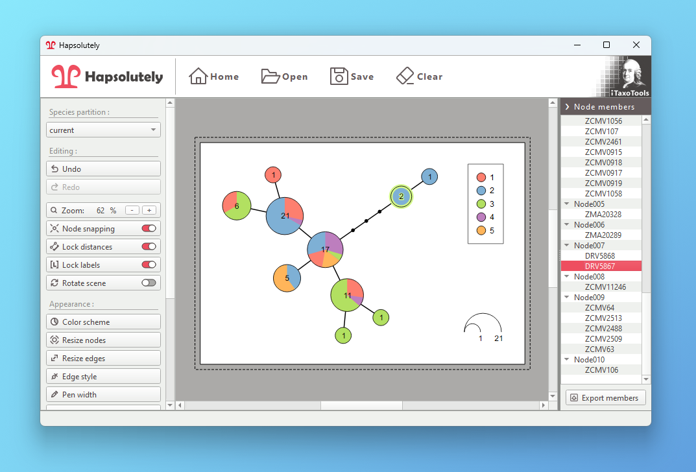

# Hapsolutely

Reconstruct haplotypes and produce genealogy graphs from population data.

- **Phase sequences**: Reconstruct haplotypes from sequence data
- **Haplotype visualization**: Generate haplotype networks, genealogies and haplowebs
- **Haplotype statistics**: Detect fields of recombinations and subset overlap



Hapsolutely is a comprehensive program that integrates [ConvPhase](https://github.com/iTaxoTools/ConvPhaseGui), [haplodemo](https://github.com/iTaxoTools/haplodemo), [popart_networks](https://github.com/iTaxoTools/popart_network) and [haplostats](https://github.com/iTaxoTools/haplostats).

Input files can be in TSV, FASTA or SPART/XML format.

## Windows and macOS Executables

Download and run the standalone executables without installing Python.</br>
[See the latest release here.](https://github.com/iTaxoTools/Hapsolutely/releases/latest)

## Usage

Please refer to the [Hapsolutely manual](https://itaxotools.org/Hapsolutely_manual_07Nov2023.pdf) for information on how to use the program.


## Installing from source

Clone and install the latest version (requires Python 3.10.2 or later):
```
git clone https://github.com/iTaxoTools/Hapsolutely.git
cd Hapsolutely
pip install . -f packages.html
hapsolutely
```

If you are also compiling *ConvPhase*, you will need all of its [dependencies](https://github.com/iTaxoTools/ConvPhase#dependencies).

### Packaging

It is recommended to use PyInstaller from within a virtual environment:
```
pip install ".[dev]" -f packages.html
pyinstaller scripts/hapsolutely.spec
```

## Citations

*Hapsolutely* was developed in the framework of the *iTaxoTools* project:

> *Vences M. et al. (2021): iTaxoTools 0.1: Kickstarting a specimen-based software toolkit for taxonomists. - Megataxa 6: 77-92.*

Sequences are phased using *PHASE* and *SeqPHASE*:

> *Stephens, M., Smith, N., and Donnelly, P. (2001). A new statistical method for haplotype reconstruction from population data. American Journal of Human Genetics, 68, 978--989.*
> <br><br>
> *Stephens, M., and Donnelly, P. (2003). A comparison of Bayesian methods for haplotype reconstruction from population genotype data. American Journal of Human Genetics, 73:1162-1169.*
> <br><br>
> *Flot, J.F. (2010) seqphase: a web tool for interconverting phase input/output files and fasta sequence alignments. Mol. Ecol. Resour., 10, 162–166.*

Networks are generated using either of *Fitchi* or *popart_networks*:

> *Matschiner M (2015) Fitchi: Haplotype genealogy graphs based on the Fitch algorithm. Bioinformatics, 32:1250-252.*
> <br><br>
> *Leigh, JW, Bryant D (2015). PopART: Full-feature software for haplotype network construction. Methods Ecol Evol 6(9):1110-1116.*
> <br><br>
> *Bandelt H, Forster P, Röhl A (1999). Median-joining networks for inferring intraspecific phylogenies. Mol Biol Evol 16(1):37-48.*
> <br><br>
> *Clement M, Snell Q, Walke P, Posada D, Crandall, K (2002). TCS: estimating gene genealogies. Proc 16th Int Parallel Distrib Process Symp 2:184.*

*BioPython* is used to create NJ trees if needed. *networkx* is used for laying out the initial graph.

> *Cock, P.J. et al., 2009. Biopython: freely available Python tools for computational molecular biology and bioinformatics. Bioinformatics, 25(11), pp.1422-1423.*
> <br><br>
> *Hagberg, A., Swart, P. & S Chult, D., 2008. Exploring network structure, dynamics, and function using NetworkX.*

